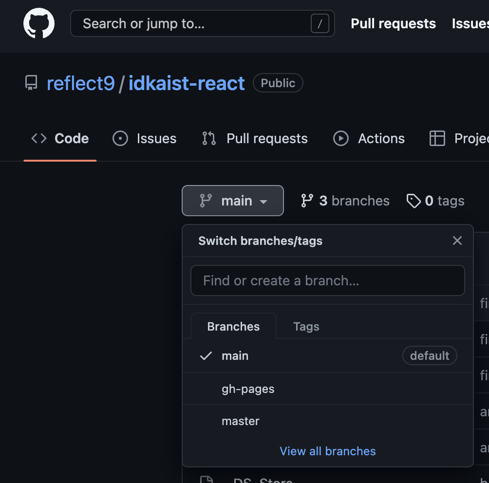

# 개요 
KAIST 산업디자인학과 홈페이지 2022년 리뉴얼 작업

# 로컬 서버 실행법 
## Git설정
1. Terminal(OSX)에서 git이 실행되는지 확인 
```
(idkaist) takyeonlee@TAKui-MacBookPro idkaist_react % git
usage: git [--version] [--help] [-C <path>] [-c <name>=<value>]
    [--exec-path[=<path>]] [--html-path] [--man-path] [--info-path]
    [-p | --paginate | -P | --no-pager] [--no-replace-objects] [--bare]
    [--git-dir=<path>] [--work-tree=<path>] [--namespace=<name>]
    [--super-prefix=<path>] [--config-env=<name>=<envvar>]
    <command> [<args>]
    ...
```
- 안되면 git설치 (https://git-scm.com/book/en/v2/Getting-Started-Installing-Git)

2. GitHub에 SSH key 추가하기
- https://docs.github.com/en/authentication/connecting-to-github-with-ssh/adding-a-new-ssh-key-to-your-github-account

## Repository 클론 하기
zip화일로 다운 받아도 실행은 가능하지만, 수정 사항을 push해서 공유하려면 클론해야함. 설치를 윈하는 폴더에 terminal을 열고 `git clone git@github.com:reflect9/idkaist-react.git`를 실행하면 다음과 같이 떠야함. 
```
(idkaist) takyeonlee@TAKui-MacBookPro temp % git clone git@github.com:reflect9/idkaist-react.git

Cloning into 'idkaist-react'...
remote: Enumerating objects: 451, done.
remote: Counting objects: 100% (73/73), done.
remote: Compressing objects: 100% (60/60), done.
remote: Total 451 (delta 11), reused 47 (delta 7), pack-reused 378
Receiving objects: 100% (451/451), 77.93 MiB | 6.73 MiB/s, done.
Resolving deltas: 100% (130/130), done.
```

# 남이 수정한 코드 추가로 받아오기 
이미 클론한 상태에서 다른 사람이 수정본을 GitHub에 올렸다면, `git pull`을 실행해서 GitHub의 최신 버전을 가져온다. 
```
(base) takyeonlee@TAKui-MacBookPro idkaist_react % git pull
remote: Enumerating objects: 15, done.
remote: Counting objects: 100% (6/6), done.
remote: Compressing objects: 100% (2/2), done.
remote: Total 15 (delta 4), reused 5 (delta 4), pack-reused 9
Unpacking objects: 100% (15/15), 2.14 MiB | 1.83 MiB/s, done.
From github.com:reflect9/idkaist-react
 * [new branch]      gh-pages   -> origin/gh-pages
Already up to date.
```

## 라이브러리 설치
- `cd idkaist-react`를 실행해서 클론한 폴더로 이동
- `npm install`을 실행해서 라이브러리 설치 (실패시 `npm install --force`도 시도); 아래처럼 warning이 좀 나와도 끝까지 실행되면 ok
```
...  added 1669 packages, and audited 1670 packages in 14s

221 packages are looking for funding
  run `npm fund` for details

17 vulnerabilities (3 moderate, 11 high, 3 critical)

To address issues that do not require attention, run:
  npm audit fix

To address all issues (including breaking changes), run:
  npm audit fix --force

Run `npm audit` for details.
```

## 로컬 서버 실행
- `npm start`실행하면 아래와 같이 나오고 브라우저 창이 자동으로 열려야함 
```
Compiled with warnings.

src/App.js
  Line 1:8:   '_' is defined but never used           no-unused-vars
  Line 16:8:  'ColorCodes' is defined but never used  no-unused-vars
... (생략)
webpack 5.66.0 compiled with 1 warning in 389 ms
```
- 마지막 라인이 나오고 브라우저 창이 새로 열리면 성공


# 소스코드 수정후 공유하기 
1. src폴더 안에 있는 소스코드를 수정한 뒤 공유할 준비가 되면, `git status`를 실행해서 바뀐 화일들 확인하기. 아래 예시에서는 `README.md`가 수정되었음. 
```
(base) takyeonlee@TAKui-MacBookPro idkaist_react % git status
On branch main
Changes not staged for commit:
  (use "git add <file>..." to update what will be committed)
  (use "git restore <file>..." to discard changes in working directory)
	modified:   README.md

no changes added to commit (use "git add" and/or "git commit -a")
```
2.  `git add .`를 실행해서 바뀐 화일들을 모두 새 commit에 등록할 준비. add를 실행하고 `git status`를 다시 실행하면, Changes to be committed에 수정된 모든 화일이 추가되었음. 
```
(base) takyeonlee@TAKui-MacBookPro idkaist_react % git add .
(base) takyeonlee@TAKui-MacBookPro idkaist_react % git status
On branch main
Changes to be committed:
  (use "git restore --staged <file>..." to unstage)
	modified:   README.md
```

3. `git commit -m "커밋메시지"`를 실행해서 commit하기. 이 때 `커밋메시지`는 현재 버전에서 주로 수정된 부분을 설명하는 적당한 문구면 충분함.
```
(base) takyeonlee@TAKui-MacBookPro idkaist_react % git commit -m "readme added"
[main 074f755] readme added
 1 file changed, 84 insertions(+), 2 deletions(-)
 ```

4. `git push`로 GitHub에 push하기; 에러가 나면 보통 메시지에서 시키는 대로 하면 해결됨. 
```
(base) takyeonlee@TAKui-MacBookPro idkaist_react % git push
fatal: The current branch main has no upstream branch.
To push the current branch and set the remote as upstream, use

    git push --set-upstream origin main
```

5. GitHub홈페이지의 idkaist-react페이지에서 내가 수정한 부분이 등록되었는지 확인하기
- 보통 폴더나 화일 리스트에 내 커밋 메시지가 적혀있고 업데이트 된 시각이 "1 minute ago"같은 식으로 나오면 제대로 등록된 것임


# 내 branch새로 만들어서 수정하기
1. 다른 사람과 동시에 작업할 때는 `git checkout -b 내브랜치네임`으로 나만의 브랜치를 새로 파서 작업한 뒤에, merge를 부탁한다. 
```
(base) takyeonlee@TAKui-MacBookPro idkaist_react % git checkout -b my_fix
Switched to a new branch 'my_fix'
```
2. `git branch`를 실행하면 존재하는 모든 branch와 현재 작업중인 것을 *표시와 함께 보여준다. 아래 예시에서는 세 브랜치 중 `my_fix`브랜치가 활성화되어있음.
```
(base) takyeonlee@TAKui-MacBookPro idkaist_react % git branch
  main
  master
* my_fix
```
3. 이 상태에서 수정하고, (위에 설명한 방식대로) add, commit, push를 실행하면 됨. 
4. GitHub홈페이지에서 특정 브랜치의 내용을 확인하려면, 아래 그림처럼 main을 누른 후, 원하는 브랜치 클릭하면 됨.  



